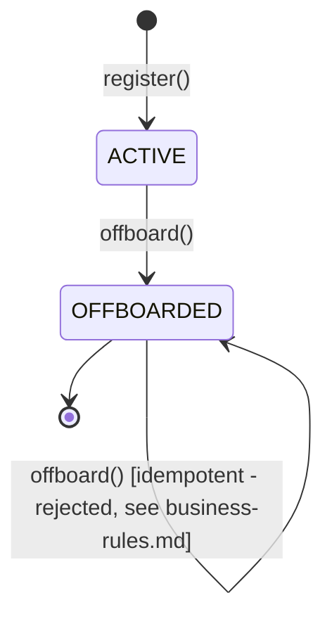

# Domain Entities - Employee Management

## Employee

| Field | Type | Constraints |
|---|---|---|
| id | Long | PK, auto-generated |
| name | String | not null, 1-255 chars |
| email | String | not null, unique (case-insensitive), valid email format, 1-255 chars |
| department | String | nullable, max 100 chars |
| position | String | nullable, max 100 chars |
| hireDate | LocalDate | nullable |
| status | EmployeeStatus (enum: `ACTIVE`, `OFFBOARDED`) | not null, default `ACTIVE` |
| offboardedAt | Instant | nullable, set only when status becomes `OFFBOARDED` |
| createdAt | Instant | not null, set on insert |
| updatedAt | Instant | not null, updated on every change |

## Relationships
- No JPA relationship/FK to `OffboardingEvent` or `AuditLog` — correlation is by matching `email` string only, consistent with how those tables already work. This is a deliberate boundary (see requirements addendum), not a gap.

## State Machine

