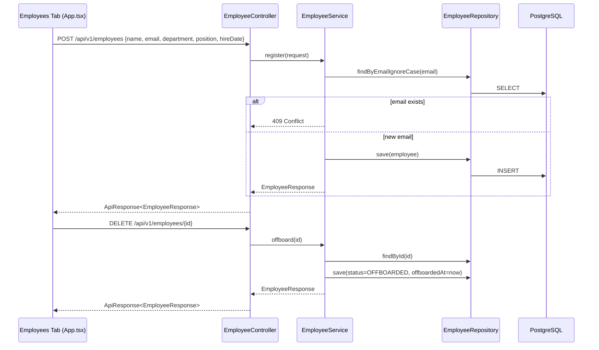

# Component Dependency - Employee Management

## Dependency Matrix

| Component | Depends On |
|---|---|
| EmployeeController | EmployeeService |
| EmployeeService | EmployeeRepository |
| EmployeeRepository | Employee (entity), Spring Data JPA, PostgreSQL |
| Frontend Employees tab | Existing `apiRequest` helper → `/api/v1/employees/**` |

## Communication Pattern
- Synchronous REST (frontend ↔ backend), synchronous method calls within backend layers — identical pattern to every existing feature (Events, Integrations, Audit)
- No new async/queue/event-driven communication introduced

## Data Flow

