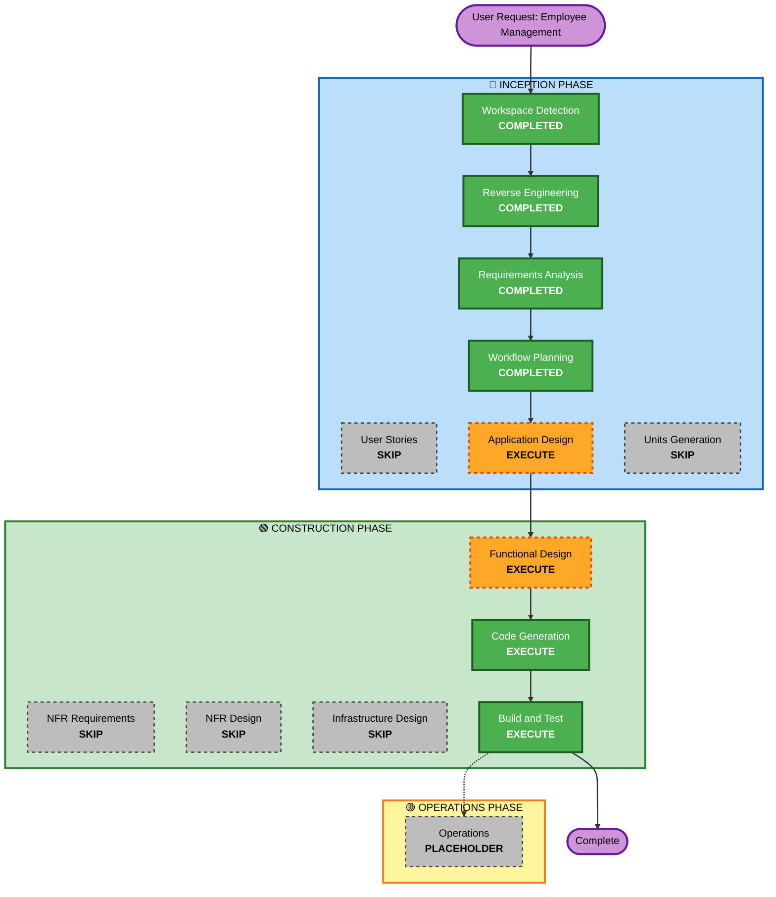

# Execution Plan - Employee Management (Feature Cycle 2)

## Detailed Analysis Summary

### Transformation Scope (Brownfield)
- **Transformation Type**: Single component addition (new `Employee` vertical slice), no architectural transformation
- **Primary Changes**: New Flyway migration, new domain model/repository/service/controller, new frontend tab
- **Related Components**: `SecurityConfig` (must add the new routes to the authenticated matcher — already covered by the existing `/api/v1/**` wildcard, no change needed), `frontend/src/App.tsx` (new nav tab)

### Change Impact Assessment
- **User-facing changes**: Yes — new "Employees" tab in the admin dashboard
- **Structural changes**: No — fits the existing layered architecture
- **Data model changes**: Yes — new `employees` table (Flyway `V2__create_employees_table.sql`)
- **API changes**: Yes — new `/api/v1/employees/**` REST resource
- **NFR impact**: No new NFRs — reuses existing JWT auth, existing DB, existing test conventions

### Component Relationships
- **Primary Component**: New `Employee` vertical slice (`domain/model/Employee.java`, `repository/EmployeeRepository.java`, `service/EmployeeService.java`, `web/controller/EmployeeController.java`, `web/dto/Employee*.java`)
- **Infrastructure Components**: None new
- **Shared Components**: Reuses `ApiResponse` DTO wrapper, `GlobalExceptionHandler`, `JwtAuthenticationFilter`
- **Dependent Components**: None depend on Employee yet (decoupled from `OffboardingEvent` by design decision in requirements)
- **Supporting Components**: Frontend `apiRequest` helper reused as-is

### Risk Assessment
- **Risk Level**: Low — additive, isolated vertical slice; no changes to existing tables/endpoints
- **Rollback Complexity**: Easy — new migration + new files only, revertible independently
- **Testing Complexity**: Simple — standard CRUD test shape, TestContainers/jqwik patterns already established in the codebase

## Workflow Visualization

## Phases to Execute

### 🔵 INCEPTION PHASE
- [x] Workspace Detection (COMPLETED)
- [x] Reverse Engineering (COMPLETED)
- [x] Requirements Analysis (COMPLETED)
- [x] User Stories (SKIPPED)
  - **Rationale**: Single persona (admin), simple CRUD, no ambiguous scenarios needing story-level clarification
- [x] Workflow Planning (this document)
- [ ] Application Design - **EXECUTE**
  - **Rationale**: New `Employee` component/service — methods and validation rules (uniqueness, soft-delete transition) need explicit definition before coding
- [ ] Units Generation - **SKIP**
  - **Rationale**: This is one cohesive unit of work (not multiple independently-developable units); no parallelization benefit from formal decomposition

### 🟢 CONSTRUCTION PHASE
- [ ] Functional Design - **EXECUTE**
  - **Rationale**: New data model + business rules (email uniqueness, soft-delete state machine) need design before implementation
- [ ] NFR Requirements - **SKIP**
  - **Rationale**: Reuses existing JWT auth, existing Postgres, existing test stack — no new NFRs introduced
- [ ] NFR Design - **SKIP**
  - **Rationale**: Depends on NFR Requirements, which is skipped
- [ ] Infrastructure Design - **SKIP**
  - **Rationale**: No new infrastructure services required (same DB, same container)
- [ ] Code Generation - **EXECUTE (ALWAYS)**
  - **Rationale**: Implementation planning and code generation needed
- [ ] Build and Test - **EXECUTE (ALWAYS)**
  - **Rationale**: Build, test, and verification needed

### 🟡 OPERATIONS PHASE
- [ ] Operations - PLACEHOLDER

## Estimated Timeline
- **Total Stages Executing**: 4 (Application Design, Functional Design, Code Generation, Build and Test)
- **Estimated Duration**: Single focused session

## Success Criteria
- **Primary Goal**: Admin can list, register, and (soft-)delete employees from the dashboard
- **Key Deliverables**: `employees` table + migration, `EmployeeController`/`EmployeeService`/`EmployeeRepository`, unit + integration + property-based tests, new "Employees" frontend tab
- **Quality Gates**: `./gradlew test` passes; new endpoints protected by existing JWT filter chain; frontend builds without errors
