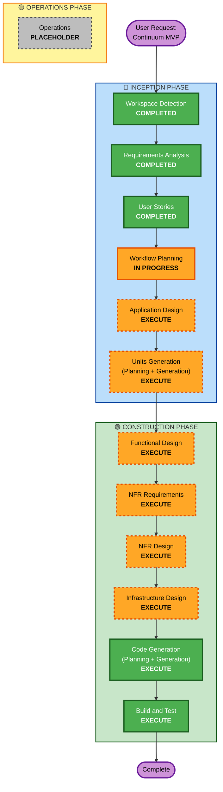

# Execution Plan - Continuum

## Detailed Analysis Summary

### Project Type
**Greenfield Project** - 완전히 새로운 B2B SaaS 플랫폼 구축

### Transformation Scope
Not applicable (Greenfield project)

### Change Impact Assessment

#### User-facing Changes
**Yes** - 전체 시스템이 새로운 사용자 대면 기능
- Web 기반 관리 대시보드 (관리자 인터페이스)
- 오프보딩 이벤트 실시간 모니터링
- 감사 로그 조회 및 CSV 내보내기
- 이메일 알림 시스템

#### Structural Changes
**Yes** - 완전히 새로운 시스템 아키텍처
- Layered Architecture (Controller → Service → Repository)
- OAuth 2.0 통합 (Slack, Google Workspace)
- Webhook 기반 이벤트 수신
- Redis 캐싱 레이어

#### Data Model Changes
**Yes** - 새로운 데이터 모델 정의 필요
- 사용자/관리자 계정 모델
- 오프보딩 이벤트 모델
- 감사 로그 모델
- OAuth 토큰 저장 스키마
- 외부 서비스 연동 설정 모델

#### API Changes
**Yes** - 새로운 API 엔드포인트 생성
- Webhook 수신 엔드포인트 (`POST /api/v1/offboarding/event`)
- 관리 대시보드 REST API
- 외부 서비스 통합 API (Slack, Google Workspace)

#### NFR Impact
**Yes** - 성능, 보안, 확장성 요구사항 존재
- **Performance**: 1초 이내 오프보딩 처리 (end-to-end)
- **Security**: OAuth 토큰 암호화, API Key 인증, TLS 1.3
- **Scalability**: 100개 고객사, 동시 10건 오프보딩 처리
- **Availability**: 99% uptime

### Component Relationships
Not applicable (Greenfield project - no existing components)

### Risk Assessment

**Risk Level**: **Medium-High**

**Rationale**:
- **OAuth 통합 복잡도**: Slack, Google Workspace OAuth 2.0 통합 경험 필요
- **1초 성능 목표**: 외부 API 호출 병렬 처리 및 최적화 필수
- **에러 처리**: 외부 API 실패 시나리오 처리 복잡 (네트워크 타임아웃, Rate limit 등)
- **MVP 범위**: F1만 구현하므로 범위는 제한적이나 핵심 기능의 안정성이 중요

**Rollback Complexity**: **Easy** (Greenfield, 기존 시스템 영향 없음)

**Testing Complexity**: **Moderate**
- Unit testing: JUnit 5 + jqwik (Property-Based Testing)
- Integration testing: 외부 API 모킹 필요
- E2E testing: Phase 2 (MVP에서는 수동 테스트)

---

## Workflow Visualization

---

## Phases to Execute

### 🔵 INCEPTION PHASE

#### ✅ Completed Stages

- [x] **Workspace Detection** - COMPLETED
  - Greenfield 프로젝트 확인
  - aidlc-state.md 초기화

- [x] **Requirements Analysis** - COMPLETED
  - MVP 범위 정의 (F1: Automated Offboarding Engine만)
  - 23개 명확화 질문 및 답변
  - 기술 스택 결정 (Java 21, Spring Boot, PostgreSQL, Redis, AWS)
  - Property-Based Testing Extension 활성화

- [x] **User Stories** - COMPLETED
  - 3개 Persona 생성 (HR Manager, IT Administrator, System Operator)
  - 19개 User Stories (16 Must Have, 3 Should Have)
  - Epic-Based 조직화 (5 Epics across 3 Phases)

- [x] **Workflow Planning** - IN PROGRESS
  - 현재 이 문서 생성 중

#### 📋 Stages to Execute

- [ ] **Application Design** - **EXECUTE**
  - **Rationale**: 
    - 새로운 컴포넌트 및 서비스 정의 필요
    - 비즈니스 로직 및 서비스 레이어 설계 필요
    - 컴포넌트 간 의존성 명확화 필요
  - **Deliverables**:
    - Component architecture diagram
    - Service layer design (OffboardingService, IntegrationService, AuditLogService)
    - API endpoint specifications
    - Data access layer design

- [ ] **Units Generation** - **EXECUTE**
  - **Rationale**:
    - 시스템을 여러 작업 단위로 분해 필요
    - 다중 서비스/모듈 구조 (Backend API, Dashboard, Integration)
    - 복잡한 시스템의 구조화된 분해 필요
  - **Deliverables**:
    - Unit breakdown plan
    - Per-unit implementation sequence
    - Unit dependencies mapping
  - **Estimated Units**: 3-5 units
    - Unit 1: Core Offboarding Engine
    - Unit 2: Admin Dashboard & API
    - Unit 3: External Service Integrations
    - Unit 4 (optional): Audit & Reporting
    - Unit 5 (optional): Infrastructure & Deployment

---

### 🟢 CONSTRUCTION PHASE

#### Per-Unit Loop Stages

**Note**: 각 Unit에 대해 아래 단계들이 순차적으로 실행됩니다.

- [ ] **Functional Design** - **EXECUTE** (per unit)
  - **Rationale**:
    - 새로운 데이터 모델 정의 필요 (사용자, 이벤트, 로그)
    - 복잡한 비즈니스 로직 (오프보딩 프로세스, 결과 집계)
    - 비즈니스 규칙 상세 설계 필요
  - **Deliverables**:
    - Data models and schemas
    - Business logic flowcharts
    - State machine diagrams (offboarding process)
    - Validation rules

- [ ] **NFR Requirements** - **EXECUTE** (per unit)
  - **Rationale**:
    - 성능 요구사항 존재 (1초 오프보딩, 동시 10건)
    - 보안 고려사항 필요 (OAuth 토큰 암호화, API Key)
    - 확장성 고려 필요 (100개 고객사, 5000명 규모)
    - 기술 스택 세부 선택 (Spring Boot 버전, PostgreSQL 구성 등)
  - **Deliverables**:
    - Performance requirements specification
    - Security controls matrix
    - Scalability design
    - Technology stack finalization

- [ ] **NFR Design** - **EXECUTE** (per unit)
  - **Rationale**:
    - NFR Requirements 단계 실행 예정
    - NFR 패턴 통합 필요 (병렬 처리, 캐싱, 에러 처리)
  - **Deliverables**:
    - Performance optimization patterns (CompletableFuture for parallel API calls)
    - Security implementation patterns (bcrypt, AES-256)
    - Caching strategy (Redis session management)
    - Error handling patterns (timeout, retry logic)

- [ ] **Infrastructure Design** - **EXECUTE** (per unit)
  - **Rationale**:
    - 인프라 서비스 매핑 필요 (AWS RDS, ElastiCache, ECS/EC2, ALB)
    - 배포 아키텍처 정의 필요
    - 클라우드 리소스 명세 필요
  - **Deliverables**:
    - AWS architecture diagram
    - Compute resource specifications (ECS Fargate tasks, EC2 instances)
    - Database design (RDS PostgreSQL instance type, backup strategy)
    - Caching design (ElastiCache Redis cluster configuration)
    - Networking design (VPC, subnets, security groups, ALB)
    - Monitoring & logging design (CloudWatch Logs, metrics)

- [ ] **Code Generation** - **EXECUTE** (per unit, ALWAYS)
  - **Rationale**: 모든 유닛에 대해 코드 생성 필수
  - **Part 1 - Planning**: 상세 코드 생성 계획 생성 (체크박스)
  - **Part 2 - Generation**: 승인된 계획 기반 코드 생성
  - **Deliverables**:
    - Java 21 source code (Spring Boot 3.x)
    - Unit tests (JUnit 5)
    - Property-based tests (jqwik)
    - Configuration files (application.yml)
    - Build configuration (Gradle/Maven)

#### After All Units Complete

- [ ] **Build and Test** - **EXECUTE** (ALWAYS)
  - **Rationale**: 빌드, 테스트, 검증 필수
  - **Deliverables**:
    - Build instructions (Gradle/Maven commands)
    - Unit test execution instructions
    - Integration test instructions (test interactions between units)
    - Performance test instructions (validate 1-second goal)
    - Build and test summary report

---

### 🟡 OPERATIONS PHASE

- [ ] **Operations** - **PLACEHOLDER**
  - **Rationale**: 향후 배포 및 모니터링 워크플로우 확장 예정
  - **Current State**: Build and Test 단계에서 모든 활동 처리

---

## Estimated Timeline

**Total Stages to Execute**: 13 stages
- INCEPTION: 2 stages (Application Design, Units Generation)
- CONSTRUCTION: 11 stages (6 per-unit stages × ~3 units estimate = ~18 stages, but consolidated)

**Estimated Duration**: 
- **Fast Track** (automated, minimal review): 3-4 hours
- **Standard** (with reviews and iterations): 1-2 days
- **Thorough** (with comprehensive reviews): 3-5 days

**Critical Path**:
1. Application Design (defines structure)
2. Units Generation (breaks down work)
3. Per-Unit Construction Loop (bulk of implementation)
4. Build and Test (validation)

---

## Success Criteria

### Primary Goal
**MVP Deliverable**: 완동하는 Continuum Automated Offboarding Engine (F1 기능만)

### Key Deliverables
1. ✅ **Functional Backend API**
   - Webhook 수신 엔드포인트
   - Slack OAuth 토큰 revoke
   - Google Workspace OAuth 토큰 revoke
   - Redis 세션 캐시 클리어
   - 감사 로그 저장

2. ✅ **Web Admin Dashboard**
   - 관리자 로그인
   - 외부 서비스 연동 설정 (Slack, Google Workspace)
   - Webhook 설정 조회
   - 최근 오프보딩 이벤트 목록
   - 이벤트 상세 조회
   - 감사 로그 조회 및 CSV 내보내기

3. ✅ **Infrastructure Deployment**
   - AWS에 배포 가능한 형태
   - PostgreSQL 데이터베이스 스키마
   - Redis 캐시 구성
   - 기본 모니터링 (CloudWatch Logs)

4. ✅ **Testing & Documentation**
   - Unit tests (70% 커버리지 이상)
   - Property-based tests (jqwik)
   - Build and test instructions
   - API 문서 (Phase 2에서 Swagger 생성, MVP는 코드 주석)
   - README (로컬 개발 환경 설정, 배포 가이드)

### Quality Gates
1. **Performance**: 오프보딩 처리 시간 ≤ 1초 (모든 외부 API 호출 완료까지)
2. **Reliability**: 정상 시나리오 성공률 ≥ 95%
3. **Security**: OAuth 토큰 암호화 저장, API Key 인증 구현
4. **Testability**: 핵심 비즈니스 로직 Property-Based Testing 커버리지 ≥ 50%
5. **Code Quality**: Java 21 + Spring Boot 모범 사례 준수, Javadoc 주석

---

## No Package Change Sequence
Not applicable (Greenfield project - no existing packages)

---

## Additional Considerations

### Property-Based Testing Integration
- **Extension Enabled**: Yes (Full enforcement)
- **Framework**: jqwik (Java)
- **Applicable Rules**: PBT-01 through PBT-10
- **Focus Areas**:
  - Round-trip properties: OAuth token encryption/decryption, JSON serialization
  - Invariant properties: Offboarding status calculation, audit log consistency
  - Idempotency: Webhook event processing (duplicate event_id handling)
  - Stateful testing: Offboarding process state machine

### Security Considerations (Extension Disabled, but basic security included)
- OAuth 2.0 token storage: AES-256 encryption
- API Key authentication: Header-based (`X-API-Key`)
- Password hashing: bcrypt
- TLS 1.3 for all communication
- GDPR/개인정보보호법 준수는 Phase 2

### Resiliency Considerations (Extension Disabled, but basic error handling included)
- External API timeout: 5초
- Error handling: 실패 시 즉시 알림 + 수동 처리
- No automatic retry logic in MVP (simplicity)
- 99% availability goal (CloudWatch monitoring)

---

**Document Version**: 1.0  
**Last Updated**: 2026-08-19  
**Author**: AI-DLC Workflow Planning  
**Status**: Ready for Approval
