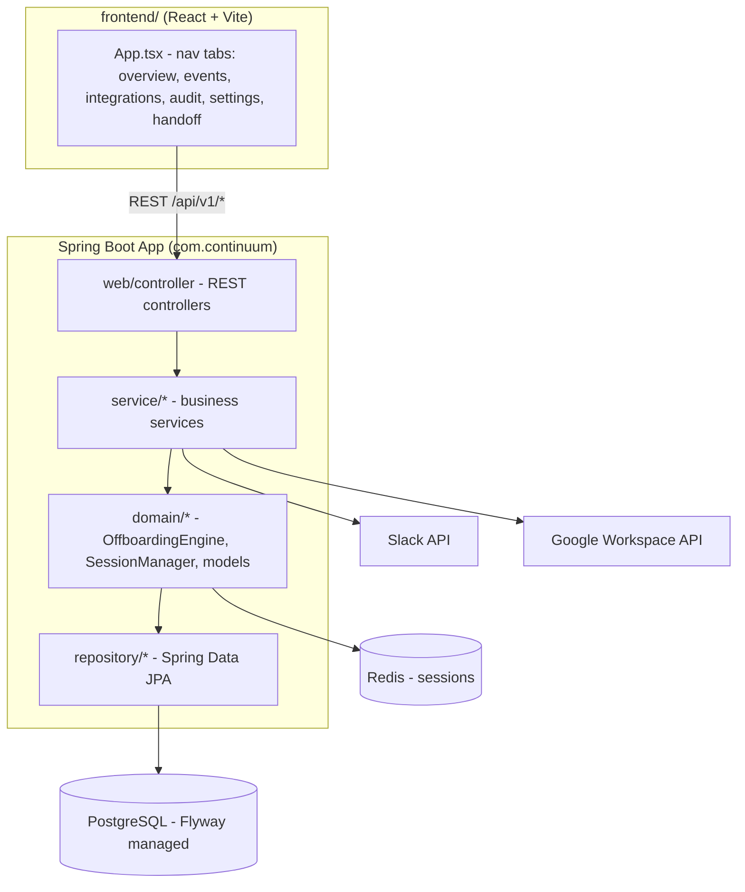
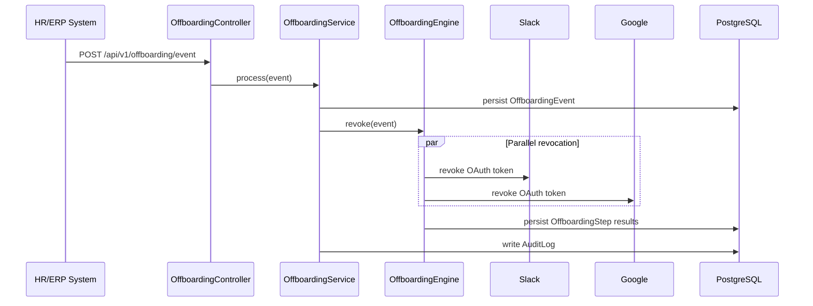

# System Architecture

## System Overview
Continuum is a single Spring Boot monolith (`com.continuum`) backed by PostgreSQL and Redis, paired with a separate React/Vite admin dashboard (`frontend/`). It is deployed as a container (ECS Fargate in AWS design docs, or Docker Compose locally).

## Architecture Diagram

## Component Descriptions

### web/controller
- **Purpose**: REST API surface
- **Responsibilities**: AuthController, EventController, AuditController, IntegrationController, OffboardingController
- **Dependencies**: service layer
- **Type**: Application

### service
- **Purpose**: Business logic
- **Responsibilities**: OffboardingService, IntegrationService, AuditService, EncryptionService, NotificationService
- **Dependencies**: domain, repository
- **Type**: Application

### domain
- **Purpose**: Core domain logic and models
- **Responsibilities**: OffboardingEngine (parallel token revocation), SessionManager, model/* (AdminUser, AuditLog, IntegrationConfig, OffboardingEvent, OffboardingResult, OffboardingStep)
- **Dependencies**: repository
- **Type**: Application
- **Note**: No `Employee` model exists

### repository
- **Purpose**: Persistence (Spring Data JPA)
- **Responsibilities**: One repository per entity (AdminUserRepository, AuditLogRepository, IntegrationConfigRepository, OffboardingEventRepository, OffboardingStepRepository)
- **Dependencies**: PostgreSQL via Flyway-managed schema
- **Type**: Application

### frontend
- **Purpose**: Admin dashboard SPA
- **Responsibilities**: Single `App.tsx` (1573 lines) containing all tabs/views and API calls via a shared `apiRequest` helper
- **Dependencies**: Backend REST API (JWT bearer auth)
- **Type**: Application

## Data Flow

## Integration Points
- **External APIs**: Slack API (OAuth revoke), Google Workspace Admin API (OAuth revoke)
- **Databases**: PostgreSQL (primary store, Flyway migrations), Redis (session/cache)
- **Third-party Services**: SMTP (notification service) for HR email alerts

## Infrastructure Components
- **Deployment Model**: Docker Compose locally; AWS ECS Fargate per `aidlc-docs/construction/build-and-test/`
- **Networking**: Not yet provisioned as IaC in this repo (design-only, per prior construction docs)
