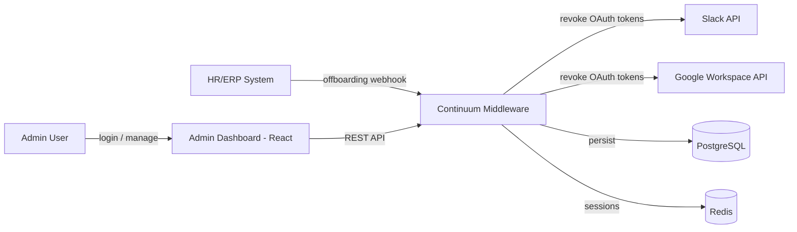

# Business Overview

## Business Context Diagram

## Business Description
- **Business Description**: Continuum is a B2B middleware that automates employee offboarding by revoking OAuth access (Slack, Google Workspace) within 1 second of receiving an offboarding event, and gives admins an audit trail and dashboard.
- **Business Transactions**:
  - Receive offboarding event from HR/ERP via webhook
  - Revoke OAuth tokens across integrated services in parallel
  - Record audit trail for compliance
  - Admin login / session management
  - Configure and test Slack/Google Workspace integrations
  - Query events, event details, and audit logs from the dashboard
- **Business Dictionary**:
  - **Offboarding Event**: A record representing an employee leaving, triggering revocation
  - **Offboarding Step**: A per-service revocation action tied to an event (e.g., Slack, Google Workspace)
  - **Integration Config**: Encrypted OAuth credentials for a connected service
  - **Employee**: Currently only represented as an email string on events/audit logs — there is **no dedicated Employee entity or management feature** in the system today

## Component Level Business Descriptions

### Backend (Spring Boot, `src/main/java/com/continuum`)
- **Purpose**: Receives offboarding webhooks, revokes tokens, exposes admin REST API
- **Responsibilities**: Auth, offboarding orchestration, integration config, audit logging

### Frontend (`frontend/`, React + Vite)
- **Purpose**: Admin dashboard to monitor events, integrations, and audit logs
- **Responsibilities**: Overview, Events, Integrations, Audit, Settings, Handoff-assistant (preview) tabs. No employee management UI exists.
