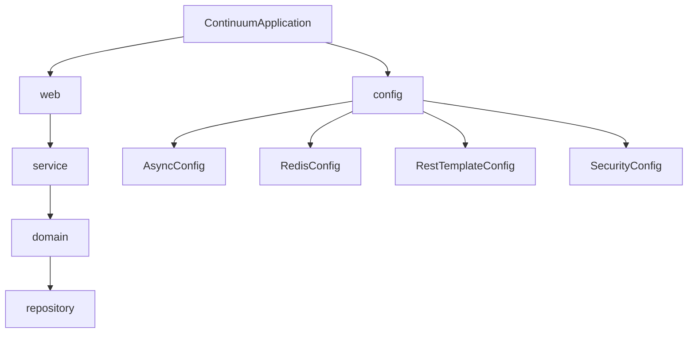

# Code Structure

## Build System
- **Backend**: Gradle (`build.gradle`, Java 21, Spring Boot 3.2)
- **Frontend**: npm/pnpm + Vite (`frontend/package.json`)

## Key Classes/Modules

### Existing Files Inventory

**Backend** (`src/main/java/com/continuum/`)
- `ContinuumApplication.java` - Spring Boot entry point
- `config/AsyncConfig.java` - thread pool for parallel offboarding
- `config/RedisConfig.java` - Redis client config
- `config/RestTemplateConfig.java` - HTTP client for Slack/Google calls
- `config/SecurityConfig.java` - Spring Security + JWT filter chain
- `domain/OffboardingEngine.java` - parallel token revocation engine
- `domain/SessionManager.java` - Redis-backed session handling
- `domain/model/AdminUser.java` - dashboard admin user entity
- `domain/model/AuditLog.java` - audit trail entity
- `domain/model/IntegrationConfig.java` - encrypted OAuth integration config
- `domain/model/OffboardingEvent.java` - offboarding event entity (keyed by employee email string)
- `domain/model/OffboardingResult.java` - result of a revocation
- `domain/model/OffboardingStep.java` - per-service step entity
- `repository/AdminUserRepository.java`, `AuditLogRepository.java`, `IntegrationConfigRepository.java`, `OffboardingEventRepository.java`, `OffboardingStepRepository.java` - Spring Data JPA repos
- `service/AuditService.java`, `EncryptionService.java`, `IntegrationService.java`, `NotificationService.java`, `OffboardingService.java` - business services
- `web/controller/AuditController.java` - `/api/v1/audit/*`
- `web/controller/AuthController.java` - `/api/v1/auth/*`
- `web/controller/EventController.java` - `/api/v1/events/*`
- `web/controller/IntegrationController.java` - `/api/v1/integrations/*`
- `web/controller/OffboardingController.java` - `/api/v1/offboarding/*`
- `web/dto/*` - request/response DTOs
- `web/exception/GlobalExceptionHandler.java`
- `web/security/CustomUserDetailsService.java`, `JwtAuthenticationFilter.java`, `JwtService.java`
- `src/main/resources/db/migration/` - Flyway SQL migrations (schema source of truth)
- **No `Employee` model, repository, service, or controller exists anywhere in the codebase.**

**Frontend** (`frontend/src/`)
- `App.tsx` - single file containing all views/tabs (overview, events, integrations, audit, settings, handoff), API client helper, and all UI components. No router/pages directory — navigation is via local React state (`activeNav`).
- `main.tsx`, `index.css`, `vite-env.d.ts`

## Design Patterns
### Layered architecture (Controller → Service → Domain → Repository)
- **Location**: Backend, consistently applied across all existing features
- **Purpose**: Separation of concerns, testability
- **Implementation**: Each REST resource has a matching Controller/Service/Repository trio; cross-cutting engine logic lives in `domain/`

### Single-file SPA (frontend)
- **Location**: `frontend/src/App.tsx`
- **Purpose**: Rapid prototyping (Figma Make generated dashboard)
- **Implementation**: All tabs/components/state defined in one file with a shared `apiRequest` fetch wrapper and inline `React.CSSProperties` styling (no component library, no router)

## Critical Dependencies
### Spring Data JPA + Flyway
- **Usage**: All persistence; schema changes must go through a new `V{n}__*.sql` migration
- **Purpose**: Type-safe repositories + versioned schema

### JWT (`io.jsonwebtoken:jjwt-api:0.12.6`)
- **Usage**: `JwtService`, `JwtAuthenticationFilter`, `SecurityConfig`
- **Purpose**: Stateless admin authentication; all new controllers must sit behind the existing security filter chain
