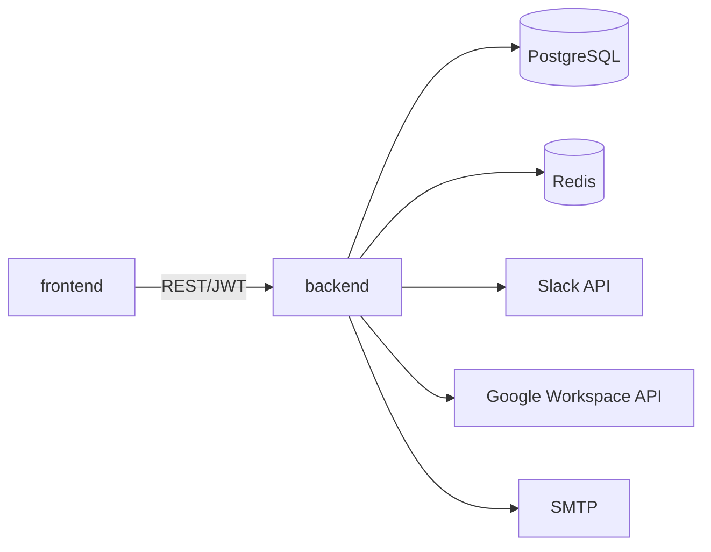

# Dependencies

## Internal Dependencies

### frontend depends on backend
- **Type**: Runtime (HTTP)
- **Reason**: All dashboard data comes from `/api/v1/**`

### backend depends on postgres
- **Type**: Runtime
- **Reason**: System of record for events, steps, audit logs, admin users, integration configs

### backend depends on redis
- **Type**: Runtime
- **Reason**: Session management (`SessionManager`)

## External Dependencies
See `technology-stack.md` for full list and versions; key ones:
- `io.jsonwebtoken:jjwt-api:0.12.6` - JWT auth, Apache 2.0
- `org.flywaydb:flyway-core:10.15.0` - schema migrations, Apache 2.0
- `redis.clients:jedis:5.1.3` - Redis client, MIT
- `org.postgresql:postgresql:42.7.3` - JDBC driver, BSD-2
